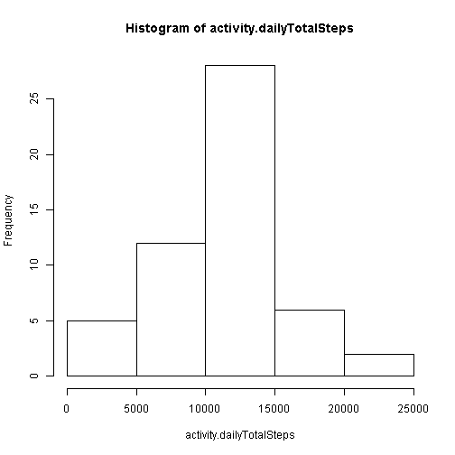
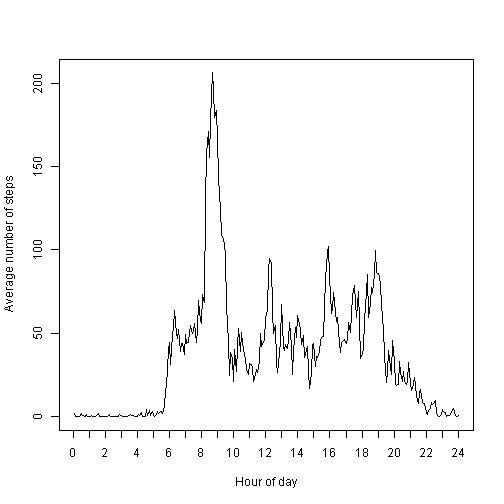
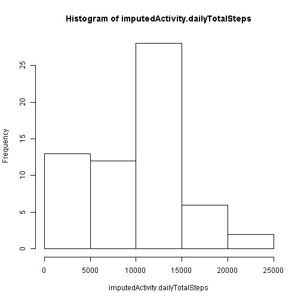
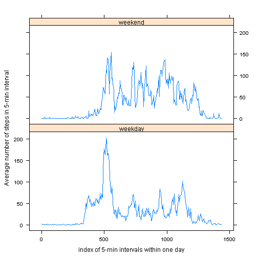

#Reproducible Research Peer Assessment 1
===========

This script loads activity.csv to variable, activity, then
performs analysis on steps variable based on different categories.

First, let's load activity.csv and check its structure.

```r
activity = read.csv(unz("activity.zip", "activity.csv"), stringsAsFactor = F)
str(activity)
```

```
## 'data.frame':	17568 obs. of  3 variables:
##  $ steps   : int  NA NA NA NA NA NA NA NA NA NA ...
##  $ date    : chr  "2012-10-01" "2012-10-01" "2012-10-01" "2012-10-01" ...
##  $ interval: int  0 5 10 15 20 25 30 35 40 45 ...
```


We have to convert date character to date type.

```r
activity$date = as.Date(activity$date, format = "%Y-%m-%d")
```


Now compute total number of steps for each day and plot histogram.

```r
activity.dailyTotalSteps = tapply(activity$steps, activity$date, sum)
hist(activity.dailyTotalSteps)
```

 


The mean and median of activity.dailyTotalSteps.

```r
mean(activity.dailyTotalSteps, na.rm = T)
```

```
## [1] 10766
```

```r
median(activity.dailyTotalSteps, na.rm = T)
```

```
## [1] 10765
```


Plot the number of steps per 5-minute, averaged across all days.

```r
steps.mean = tapply(activity$steps, activity$interval, mean, na.rm = T)
plot(steps.mean, type = "l", xaxt = "n", xlab = "Hour of day", ylab = "Average number of steps")
xtk = seq(0, 288, 12)
axis(1, at = xtk, labels = xtk/12)
```

 


Report which 5-minute interval, on average, has the maximum steps and the index of that max in steps.mean array.

```r
which.max(steps.mean)
```

```
## 835 
## 104
```


How many missing values (NA) do we have in this activity?

```r
sum(is.na(activity$steps))
```

```
## [1] 2304
```


Replace NA with previous value in time series of the new data frame, imputedActivity.

```r
na.location = is.na(activity$steps)
imputedActivity = activity
if (na.location[1]) {
    lastSteps = 0
    imputedActivity$steps[1] = 0
} else {
    lastSteps = imputedActivity$steps[1]
}
na.location[1]
```

```
## [1] TRUE
```

```r
imputedActivity$steps[1]
```

```
## [1] 0
```

```r
for (i in seq(2, nrow(imputedActivity))) {
    if (na.location[i]) {
        imputedActivity$steps[i] = lastSteps
    } else {
        lastSteps = imputedActivity$steps[i]
    }
}
sum(is.na(imputedActivity$steps))
```

```
## [1] 0
```


Now compute total number of steps for each day and plot histogram for imputedActivity.

```r
imputedActivity.dailyTotalSteps = tapply(imputedActivity$steps, imputedActivity$date, 
    sum)
hist(imputedActivity.dailyTotalSteps)
```

 


The mean and median of activity.dailyTotalSteps.

```r
mean(imputedActivity.dailyTotalSteps, na.rm = T)
```

```
## [1] 9354
```

```r
median(imputedActivity.dailyTotalSteps, na.rm = T)
```

```
## [1] 10395
```


We can clearly see mean and median values change after we impute.  Both of them become larger.

Let's compare activities between weekdays and weekends.
First, partition days into weekday and weekend.

```r
imputedActivity$day = weekdays(imputedActivity$date)
imputedActivity$day[imputedActivity$day == "Sunday" | imputedActivity$day == 
    "Saturday"] = "weekend"
imputedActivity$day[imputedActivity$day != "weekend"] = "weekday"
imputedActivity$day = as.factor(imputedActivity$day)
```


Plot average number of steps for each 5-min interval, averaging over weekdays, and over weekends.
Note that we need to load lattice plotting system library.

```r
library(lattice)
weekdayActivity = subset(imputedActivity, imputedActivity$day == "weekday")
weekendActivity = subset(imputedActivity, imputedActivity$day == "weekend")
s1 = tapply(weekdayActivity$steps, weekdayActivity$interval, mean)
s2 = tapply(weekendActivity$steps, weekendActivity$interval, mean)
meanSteps = c(s1, s2)
interval = c(seq(0, 1435, 5), seq(0, 1435, 5))
day = c(rep("weekday", 288), rep("weekend", 288))
plotData = data.frame(meanSteps, interval, day)
plotData$day = as.factor(plotData$day)
xyplot(meanSteps ~ interval | day, data = plotData, type = "l", ylab = "Average number of steps in 5-min interval", 
    xlab = "index of 5-min intervals", layout = c(1, 2))
```

 


We can clearly see the difference between these two plots.
